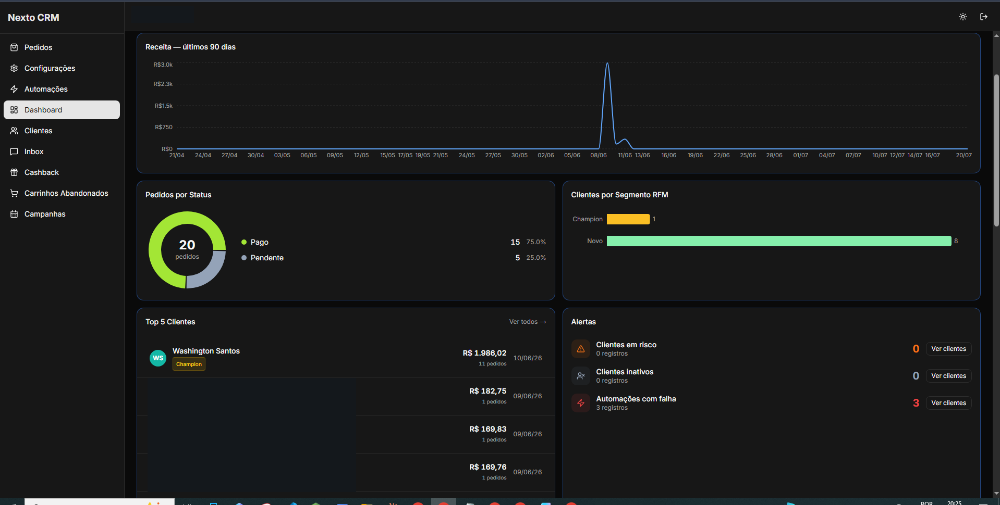

# Portfólio — Washington dos Santos Oliveira

Site estático (HTML/CSS/JS puro, sem build) para candidatura a vagas de
estágio em Banco de Dados.

## Estrutura

```
portfolio/
├── index.html          → todo o conteúdo, estilos e markup da página
├── assets/
│   ├── favicon.svg      → monograma "WO" (vetor, sem dependências)
│   └── img/              → screenshots de projetos (adicionar quando prontos)
└── README.md
```

Não há passo de build: `index.html` é a página final, pronta para publicar.

## Como editar

### Cores

Todas as cores vêm de variáveis CSS no topo do `<style>`, dentro de `:root`
(por volta da linha 21 de `index.html`):

```css
:root{
  --bg: #F5F6F3;        /* fundo da página */
  --surface: #FFFFFF;   /* cards, superfícies */
  --ink: #14181C;       /* texto principal */
  --accent: #24409E;    /* azul-índigo — cor de destaque */
  --teal: #0E7D77;      /* secundária */
  --amber: #B5760F;     /* alerta suave, badges */
  ...
}
```

Mudar uma variável atualiza a cor em todos os lugares que a usam.

### Textos

Todo o conteúdo (nome, pitch, seções, cards) está direto no HTML dentro de
`index.html`. Basta localizar o texto e editar — não há arquivos de
tradução/config separados.

### Adicionar um novo projeto

1. Abra `index.html` e localize a seção `#projetos`.
2. Copie um bloco `<article class="proj-card"> ... </article>` inteiro
   (por exemplo, o do "Fluente").
3. Cole o bloco copiado **antes** do card tracejado
   (`<article class="proj-card placeholder">`) — esse card "+" deve
   permanecer sempre por último.
4. Troque título, descrição, tags e links (`proj-link`) para o novo projeto.
5. Se o projeto tiver repositório privado, use o badge
   `<span class="badge badge-amber">Repositório privado</span>` (ou
   `badge-teal` para variar a cor).

### Adicionar prints a um projeto (galeria/lightbox)

Cada card pode ter um botão **"Ver prints (N) →"** que abre um lightbox com
as imagens daquele projeto. Isso é feito por um par botão + container:

```html
<div class="proj-gallery-data" data-gallery="crm-next" hidden>
  
</div>
```
```html
<button type="button" class="proj-link gallery-btn" data-gallery-trigger="crm-next">
  Ver prints (1) →
</button>
```

O `data-gallery` do container e o `data-gallery-trigger` do botão precisam
ser **iguais** — é assim que o JS (no final do `<body>`) liga um ao outro.

Para adicionar mais prints a um projeto existente: coloque a imagem em
`assets/img/<projeto>/`, adicione um `` dentro do
`.proj-gallery-data` daquele projeto, e atualize o número no texto do botão.

**Cuidado com dados sensíveis:** antes de adicionar qualquer print (CRM,
dashboards etc.), confira se não expõe nome de cliente, e-mail, endereço ou
nome do negócio — o repositório é público.

### Trocar o link do projeto Fluente

Quando a etapa de segurança de dados do Fluente for concluída, troque o link
do GitHub em `#projetos` de `https://github.com/washington-santos` (perfil)
para o repositório específico, ex.
`https://github.com/washington-santos/fluente`.

### Favicon

`assets/favicon.svg` é um SVG (não `.ico`) com o monograma "WO" nas cores da
marca — funciona nos navegadores atuais sem dependências extras. Para trocar
o desenho, edite o `<text>` ou as cores diretamente no arquivo SVG.

## Como publicar (Vercel)

Projeto estático — não precisa de build command nem output directory
customizados.

**Opção 1 — via GitHub (recomendado):**
1. Suba este repositório para o GitHub.
2. Em https://vercel.com, importe o repositório ("Add New… → Project").
3. Deixe o framework preset como "Other" e confirme o deploy.
4. Todo push na branch principal gera um novo deploy automaticamente.

**Opção 2 — via CLI:**
```bash
npm i -g vercel
vercel login
vercel        # deploy de preview
vercel --prod # deploy de produção
```

Nenhuma variável de ambiente é necessária — o site é 100% estático, sem
backend nem banco de dados nesta fase.
